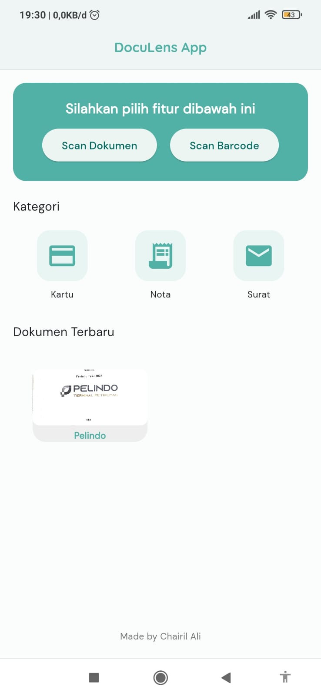
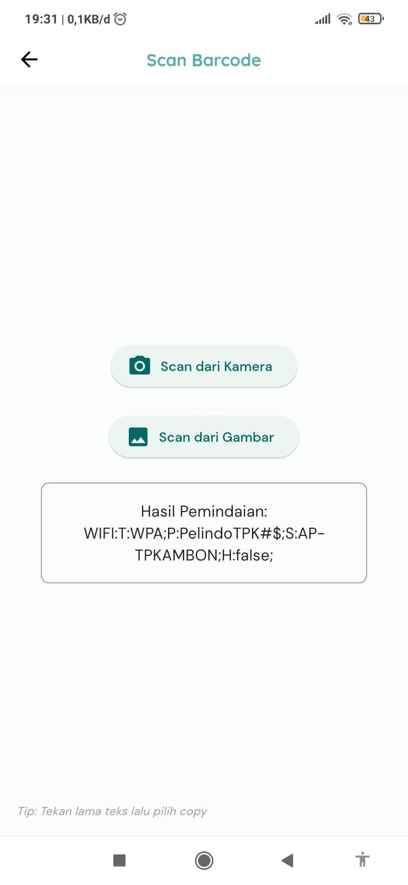

# DocuLens

A powerful Flutter mobile application for document scanning and barcode reading with local storage capabilities.

## Features

### 📄 Document Scanning
- **Smart Document Scanner**: Scan physical documents using your device camera
- **Image Enhancement**: Automatic image cleaning and optimization for better readability
- **Multiple Formats**: Support for JPEG document format
- **Gallery Import**: Import and scan documents from your device gallery
- **Scanning Tips**: Built-in guidance for optimal scanning results

### 📱 Barcode Scanner
- **Real-time Barcode Scanning**: Scan barcodes using device camera
- **Image-based Scanning**: Scan barcodes from existing images in gallery
- **Multiple Barcode Formats**: Support for various barcode types
- **Copy Results**: Easy copy functionality for scanned barcode data

### 🗂️ Document Management
- **Categorization**: Organize documents into categories (Cards, Receipts, Letters)
- **Local Storage**: Secure local database storage using SQLite
- **Document History**: View all scanned documents with timestamps
- **Category Filtering**: Browse documents by specific categories
- **Delete Functionality**: Remove unwanted documents

### 🎨 User Interface
- **Modern Design**: Clean and intuitive Material Design interface
- **Google Fonts**: Beautiful typography using DM Sans and Quicksand fonts
- **Responsive Layout**: Optimized for various screen sizes
- **Custom Theming**: Consistent color scheme throughout the app

## Screenshots

### 🏠 Home Screen


*Main dashboard with document scanning and barcode scanning options*

### 📄 Document Scanning Process


*Smart document scanner with automatic detection and capture*

### ✨ Scan Results


*Enhanced document image with cleaning and optimization*

### 🔤 Text Extraction


*OCR text recognition from scanned documents*

### 📱 Barcode Scanner


*Real-time barcode scanning with camera*

### 📋 Document List


*Browse and manage saved documents by category*

### 📖 Document Details


*View detailed information and manage individual documents*

## Download

### 📱 Get the App

You can download the latest version of DocuLens directly from our GitHub releases:

**[📥 Download Latest Release](https://github.com/Chairil13/Doculens-App/releases/latest)**

#### Available Downloads:
- **APK File**: Ready-to-install Android package
- **Source Code**: Complete project source for developers

#### Installation Steps:
1. Download the APK file from the releases page
2. Enable "Install from Unknown Sources" in your Android settings
3. Open the downloaded APK file and follow the installation prompts
4. Grant necessary permissions (Camera, Storage) when prompted

> **Note**: The app requires Android 5.0 (API level 21) or higher

## Installation

### Prerequisites
- Flutter SDK (>=3.3.0 <4.0.0)
- Dart SDK
- Android Studio / VS Code
- Android device or emulator

### Setup

1. **Clone the repository**
   ```bash
   git clone <repository-url>
   cd doculens
   ```

2. **Install dependencies**
   ```bash
   flutter pub get
   ```

3. **Configure permissions**
   
   The app requires camera and storage permissions. These are automatically handled by the included packages.

4. **Run the application**
   ```bash
   flutter run
   ```

## Dependencies

### Core Dependencies
- `flutter_barcode_scanner`: Barcode scanning functionality
- `google_mlkit_barcode_scanning`: ML Kit barcode recognition
- `google_mlkit_document_scanner`: Document scanning capabilities
- `google_mlkit_text_recognition`: Text recognition from images
- `sqflite`: Local SQLite database
- `image_picker`: Image selection from gallery/camera
- `path_provider`: File system path access
- `permission_handler`: Runtime permissions management

### UI & Utilities
- `google_fonts`: Custom font integration
- `intl`: Internationalization and date formatting
- `pdf`: PDF generation capabilities
- `image_gallery_saver`: Save images to device gallery
- `open_file`: Open files with system apps

### Development
- `flutter_launcher_icons`: Custom app icon generation
- `change_app_package_name`: Package name modification
- `flutter_lints`: Code quality and style enforcement

## Project Structure

```
lib/
├── core/                   # Core utilities and constants
│   ├── colors.dart        # App color scheme
│   ├── custom_text_field.dart
│   ├── spaces.dart        # Spacing utilities
│   └── title_content.dart # Reusable title components
├── data/                  # Data layer
│   ├── datasources/       # Data sources
│   │   └── document_local_datasource.dart
│   └── models/            # Data models
│       └── document_model.dart
├── pages/                 # UI screens
│   ├── barcode_scanner_page.dart
│   ├── category_button.dart
│   ├── detail_document_page.dart
│   ├── document_category_page.dart
│   ├── home_page.dart
│   ├── latest_documents_page.dart
│   ├── menu_categories.dart
│   └── save_document_page.dart
└── main.dart             # App entry point
```

## Usage

### Scanning Documents
1. Open the app and tap "Scan Dokumen" on the home screen
2. Follow the scanning tips dialog for best results
3. Position your document within the camera frame
4. The app will automatically detect and capture the document
5. Review the scanned image and save with a name and category

### Scanning Barcodes
1. Tap "Scan Barcode" on the home screen
2. Choose between camera scanning or image import
3. Point camera at barcode or select image from gallery
4. View and copy the scanned barcode data

### Managing Documents
1. Browse documents by category from the home screen
2. View document history in "Latest Documents"
3. Tap on any document to view details
4. Delete unwanted documents using the delete function

## Configuration

### App Icon
The app uses a custom icon located at `assets/icon.png`. To change the icon:
1. Replace the icon file in the assets folder
2. Run `flutter pub run flutter_launcher_icons:main`

### Database
The app uses SQLite for local storage with the following schema:
- **documents** table: id, name, path, category, createdAt

## Contributing

1. Fork the repository
2. Create a feature branch (`git checkout -b feature/amazing-feature`)
3. Commit your changes (`git commit -m 'Add some amazing feature'`)
4. Push to the branch (`git push origin feature/amazing-feature`)
5. Open a Pull Request

## License

This project is licensed under the MIT License - see the LICENSE file for details.

## Author

**Chairil Ali**

## Acknowledgments

- Google ML Kit for powerful document and barcode scanning capabilities
- Flutter team for the amazing framework
- All contributors and package maintainers

---

*Built with ❤️ using Flutter*
